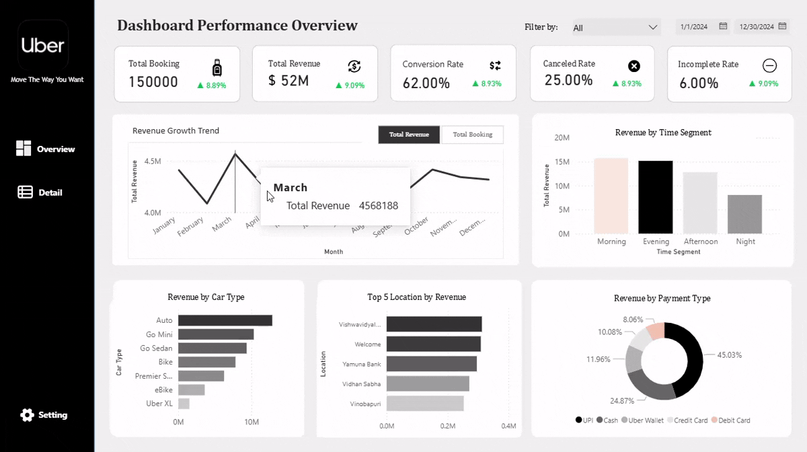

## Uber Mobility Analytics Dashboard

  

## Resources
- [Dashboard Power BI](https://github.com/bintangpradanaa/uber-mobility-analytics-dashboard/tree/main/dashboard)
- [Requirement Document](https://docs.google.com/document/d/1T8a7g-McFJYWWhHm3DSBUKoxQOds0KhgyqJm3QSKVrA/edit?usp=sharing)

## Project Overview
This project focuses on analyzing Uber's mobility platform by integrating key business and operational metrics into a centralized interactive dashboard. 

As a **Data Analyst**, this dashboard is designed to provide insights into booking performance, revenue trends, service efficiency, and customer behavior, enabling stakeholders to make data-driven decisions and improve overall platform performance.

## Objectives
- Monitor overall platform performance (bookings, revenue, service rates)
- Analyze demand patterns across time and locations
- Evaluate service efficiency (completion, cancellation, response time)
- Understand customer behavior and ride characteristics

## Tools
- Power BI (Dashboard & Data Modeling)
- Power Query (Data Transformation)
- DAX (Measures & Calculations)

## Key Dashboard
### Executive Overview
- KPI Cards: Total Booking, Total Revenue, Completion Rate, Canceled Rate, Incomplete Rate
- Trends: Revenue Growth, Booking Growth
- Time Analysis: Revenue by Time Segment
- Product Analysis: Revenue by Vehicle Type
- Location Analysis: Top 5 Locations by Revenue
- Payment Analysis: Revenue by Payment Method

### Operational & Behavioral Insights
- KPI Cards: Avg Booking Value, Avg Distance, Avg CTAT, Avg Customer Rating, Avg Driver Rating
- Behavior Analysis: Booking Distribution by Distance Segment
- Quality Analysis: Rating Distribution (1-5)
- Vehicle Performance Table:
  - Revenue per vehicle type
  - Total bookings per vehicle type
  - Total canceled rides per vehicle type
  - Revenue trend vehicle type

## Key Insights
- Identify peak demand periods and high-performing locations
- Understand which vehicle types contribute most to revenue
- Evaluate service efficiency through completion and cancellation rates
- Analyze customer satisfaction through rating distribution
- Detect operational issues through CTAT and incomplete rides
